# School_District_Analysis
Module 4: Anaconda, Jupyter, Panda

## Overview 

The Chief Data Scientist for the city school district named Maria had asked for help to analyze data on student funding and student standardized test scores. The initial tasks is to aggregate the data and showcase trends in school performance. This analysis will help the school board and superintendent in making decisions regarding the school budgets and prioreties.  

The second part of the project was to repeat the same school district analysis but removing some information from a specific school and grade because the data cannot be trusted. The result will then be described in this report showing how the changes affected the overall analysis.

## Results: 

The outcome of the analysis presented below is a result of data comaparison between the initial and the corrected report analysis.

1. **How is the district summary affected?**

	The changes on the results of the corrected analysis  	report	is neglible. See data comparison shown below:
	
	Initial report:
	
	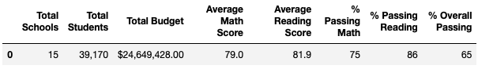
	
	
	Corrected report:
	
	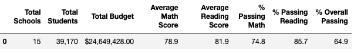
	

2. **How is the school summary affected?**

	*The results show after correction, that the data 	was	not significantly impacted.*  

3. **How does replacing the ninth graders’ math and 	reading scores affect Thomas High School’s 	performance relative to the other schools?**

	*Thomas High School's performance based on average 	math and reading scores has slightly changed. 	However, in terms of % 	overall passing, compared to 	other shchools, Thomas high school keeps its 	standing as the second ranked in the top 5 school in 	the district. See list of top 5 schools below taken 	from the initial and corrected reports:* 
	
	Initial report:
	
	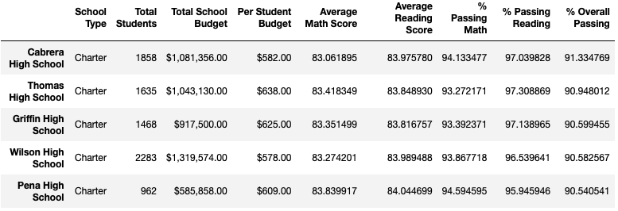

	
	Corrected report:
	
	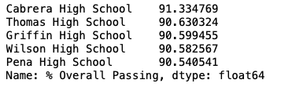
	
	
4. **How does replacing the ninth-grade scores affect 	the following:**

- Math and reading scores by grade

	*Both math and reading scores by grade were not 	affected.*

- Scores by school spending

	*The corrected report data shows slight increase in 	spending compared to the initial data as shown 	below:*
	
	Initial report:
	
	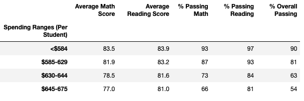	
	
	Corrected report:
	
	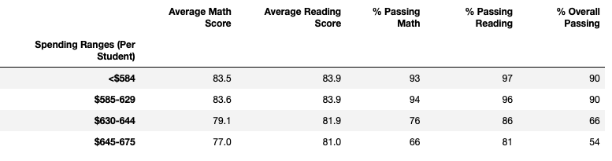
	
- Scores by school size

	*Data was not affected.*
	
	Initial report:
	
	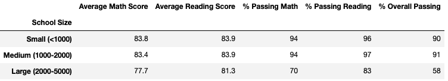

	
	Corrected report:
	
	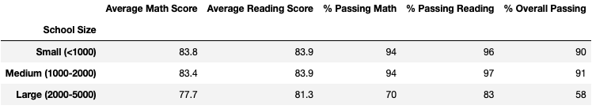
	
- Scores by school type

	*If you review the results of the corrected report 	before the data are rounded to the nearest tenths, 	you can see that the changes on the scores of the 	charter schools is negligible and therefore, when 	you compare the results of the rounded data for both 	initial and 	the corrected reports, final scores 	are basically the same. Refer to shown images of the 	reports below:*
	
	Initial report: (unrounded)
	
	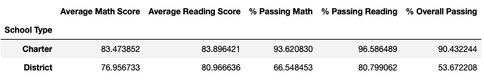

	Corrected report: (unrounded)
	
	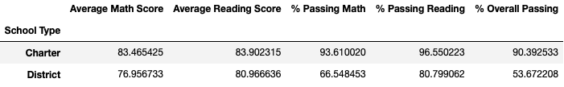
	
	Initial & Corrected Summary Reports: (rounded)
	
	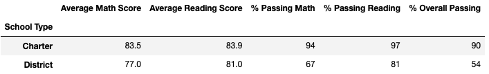
	
	
##Summary: 

The overall impact of the change made on the corrected data analysis report in terms of reading and math grades, spending, scores by school size and school type is negligible. Removing the ninth grader's reading and math grades from the Thomas High School did not significantly impact the outcome of the previous analysis. However, the decision to re-evaluate the scores is important as we want the data to be thrustworthy. 

